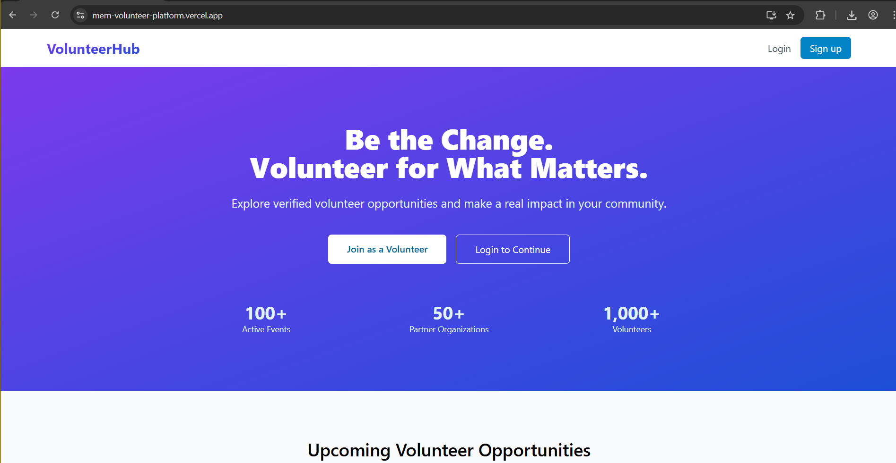
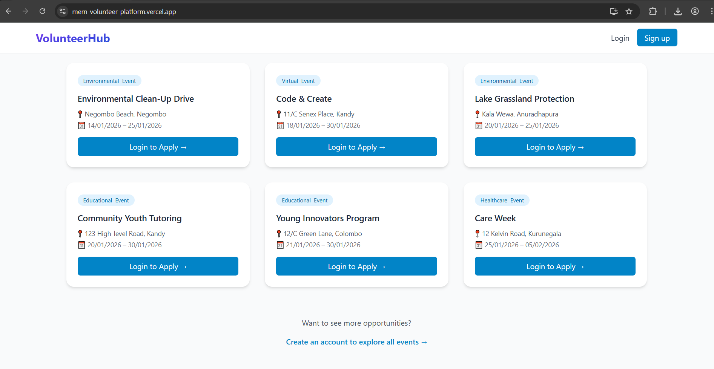
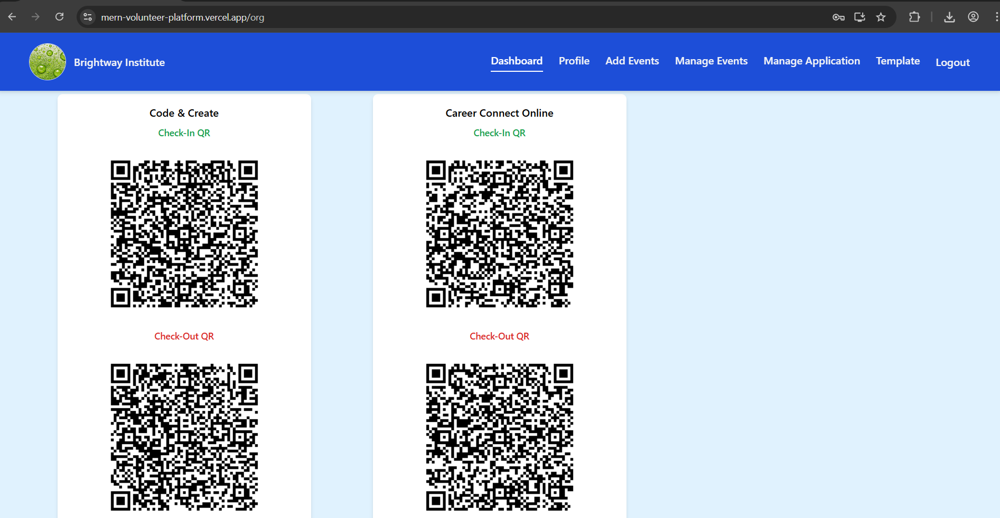
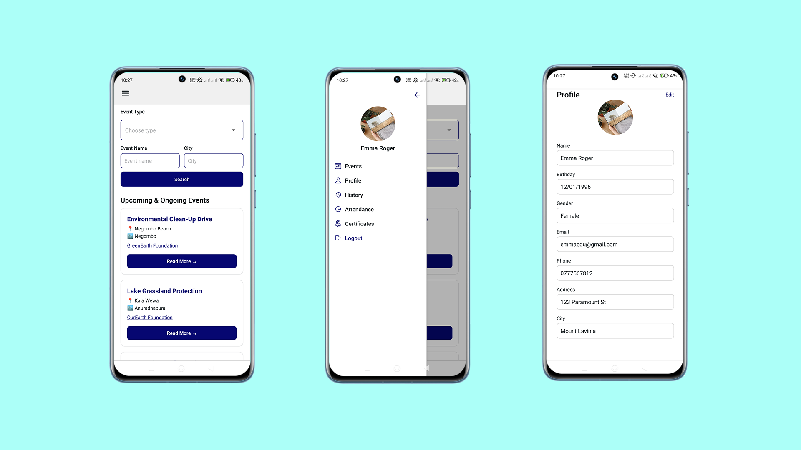
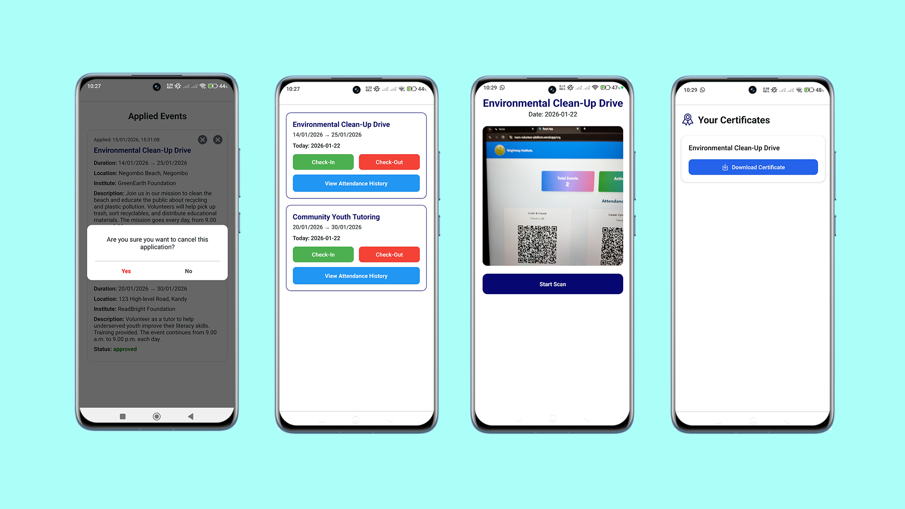
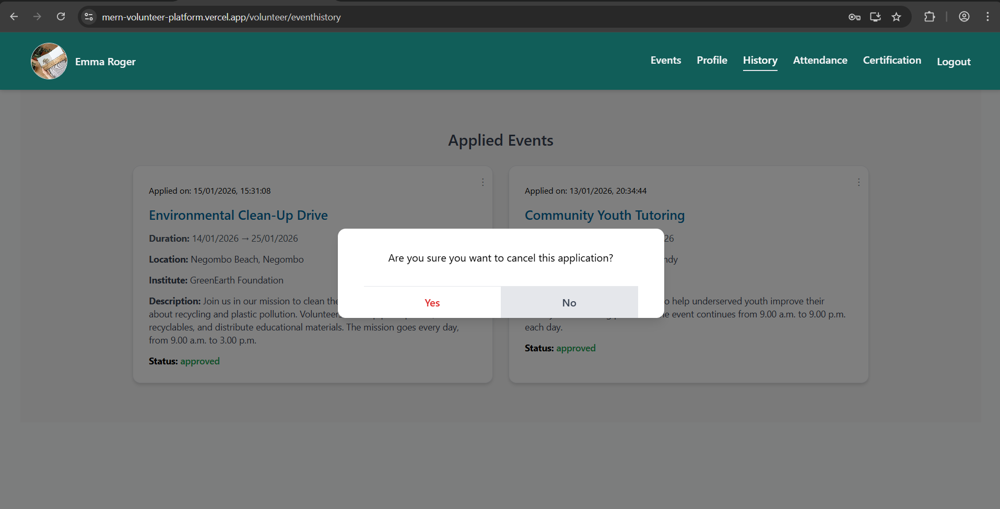
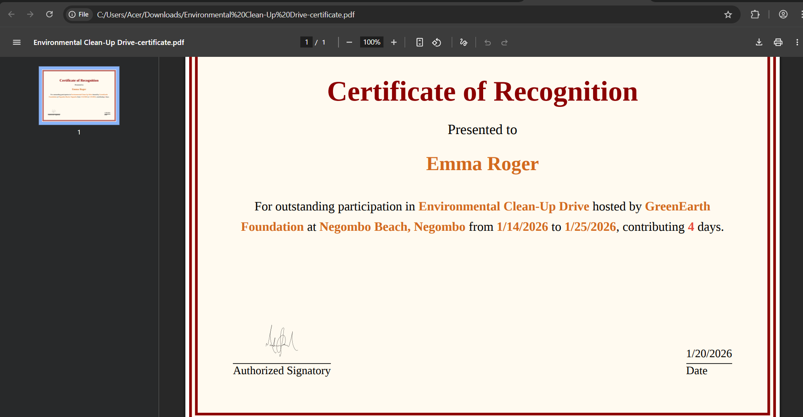

🟡🟡 MERN Volunteer Management Platform 🟡🟡
A full-stack MERN-based volunteer management system with an integrated React Native mobile application, designed to streamline event coordination, volunteer participation, attendance tracking, and certificate generation.

▶ Overview
This platform enables organizations to efficiently manage volunteer-driven events while providing volunteers with a seamless experience across web and mobile applications.
It features role-based access control, secure workflows, QR-based attendance tracking, and automated certificate generation, ensuring data integrity, scalability, and usability.

▶ Key Features
🔶 Authentication & Security
•	JWT-based authentication
•	Role-Based Access Control (RBAC):
o	Super Admin
o	Organization Admin
o	Volunteer

🔶 Volunteer Management
•	Volunteer registration and login
•	Apply for events
•	Track application status
•	View attendance history
•	Access certificates

🔶 Organization Management
•	Create and manage events
•	Review and approve/reject volunteer applications
•	Monitor participation and attendance

🔶 Event Management
•	Event creation with date/time validation
•	Participant tracking
•	Approval-based participation system

🔶 QR-Based Attendance System
•	Secure time-bound QR tokens
•	Check-in and check-out functionality
•	Validation based on:
o	Event date
o	Time window
o	Approval status
o	Token expiration

🔶 Certificate Generation
•	Dynamic certificate creation using templates
•	Placeholder-based customization (name, event, etc.)
•	Eligibility-based access for volunteers
•	Downloadable certificates

🔶 File & Image Management
•	Profile images and qualification PDFs stored using Cloudinary
•	Secure and scalable file handling
•	Optimized delivery via CDN

🔶 Cross-Platform Experience
•	Web application (React)
•	Mobile application (React Native with Expo)
•	Responsive and modern UI design

🔶 Tech Stack
Frontend (Web)
•	React
•	Axios
•	Tailwind CSS (or your styling framework)
Mobile App
•	React Native (Expo)
Backend
•	Node.js
•	Express.js
•	RESTful APIs
Database
•	MongoDB Atlas (Cloud-hosted)
File Storage
•	Cloudinary (Images & PDFs)
Authentication
•	JSON Web Tokens (JWT)
Deployment
•	Frontend: Vercel
•	Backend: Render
Testing
•	Jest + Supertest
•	MongoDB Memory Server (for isolated test environment)

🔶 CI/CD
•	Automated deployments via GitHub integration:
o	Vercel for frontend
o	Render for backend
•	Backend CI pipeline using GitHub Actions:
o	Runs integration tests on every push and pull request
o	Uses in-memory MongoDB for isolated testing

🔶 Deployment
•	Frontend: Hosted on Vercel
•	Backend: Hosted on Render
•	Database: MongoDB Atlas
•	File Storage: Cloudinary

Screenshots

    
    
    
    
    
    
    

Author
Sasun Madhuranga
GitHub: https://github.com/sasunmadhuranga

